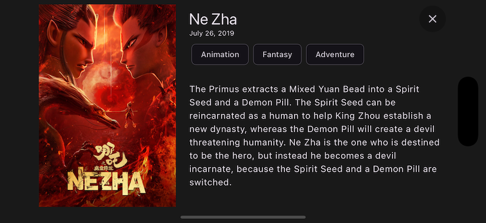

# Flutter Popular Movies

Flutter app example that consumes TMDB API to show popular movies in a paginated GridView. It has a clean architecture to separate concerns on different layers.

## Features

- Browse popular movies
- View movie details
- Search for movies

# Screenshots
### Home


### Search


### Movie Details



## Architecture

This project is structured following the principles of Clean Architecture, which divides the code into distinct layers: presentation, domain, and data. This separation of concerns makes the codebase more maintainable, testable, and scalable.


## Installation

Once you have generated your project, make sure to execute the following steps to complete the project setup:

1. Build local packages.
    1. ```cd packages/movies_api```
    2. ```flutter pub get```
    3. ```flutter pub run build_runner build --delete-conflicting-outputs```
    4. ```cd packages/app_storage```
    5. ```flutter pub get```
    6. ```flutter pub run build_runner build --delete-conflicting-outputs```
1. From a terminal, run the following commands:
    1. ```flutter pub get```
    2. ```dart run build_runner clean```
    2. ```flutter pub run build_runner build --delete-conflicting-outputs```
2. Add your API KEY: This project requires an api key to be used to fetch the movies. 
    1. Get an api key from https://www.themoviedb.org/settings/api.
    2. Pass your api key to the flutter run command as an environment variable as follows:
```sh
$ flutter run --target lib/main.dart --dart-define=API_TOKEN=<your-apikey>
```

3. Or if you run this from VSCode you can use the launch configurations already set, so you just need to create a new ```config.json``` file under the ```.vscode``` folder, and have a content like:
```{ "API_TOKEN": "your-api-key" }```

## Working with Translations 🌐

This project relies on [flutter_localizations][flutter_localizations_link] and follows the [official internationalization guide for Flutter][internationalization_link].

### Adding Strings

1. To add a new localizable string, open the `app_en.arb` file at `lib/l10n/arb/app_en.arb`.

```arb
{
    "@@locale": "en",
    "counterAppBarTitle": "Counter",
    "@counterAppBarTitle": {
        "description": "Text shown in the AppBar of the Counter Page"
    }
}
```

2. Then add a new key/value and description

```arb
{
    "@@locale": "en",
    "counterAppBarTitle": "Counter",
    "@counterAppBarTitle": {
        "description": "Text shown in the AppBar of the Counter Page"
    },
    "helloWorld": "Hello World",
    "@helloWorld": {
        "description": "Hello World Text"
    }
}
```

## Packages Used
### Local packages
- `movies_api`: A local package in the workspace to help calling the movies API.
- `app_storage`: To store key-value in the local storage, used to store the locale.

### Third party packages
- `auto_route`: Helps managing the navigation in the app
- `flutter_bloc`: A great state manager for presenting data in the UI.
- `freezed`: Reduces boilerplate code creating models and supercharhe them with useful methods.
- `get_it`, `injectable`: Helps managing the dependency injection.
- `cached_network_image`: Caches images for improving performance loading images.
- `lottie`: Handles the lottie animation files.
- `rx_dart`: Helps managing streams, used for the pagination feature.
- `hive_ce`: To create a no-sql database storing the movies.
- `retrofit`, `dio`: Handle the network calls to the api.
- `dio_cache_interceptor`: Caches the API response to improve performance.

## Contributing

Contributions are welcome! Please fork the repository and create a pull request with your changes.

## License

This project is licensed under the MIT License. See the [LICENSE](LICENSE) file for more details.